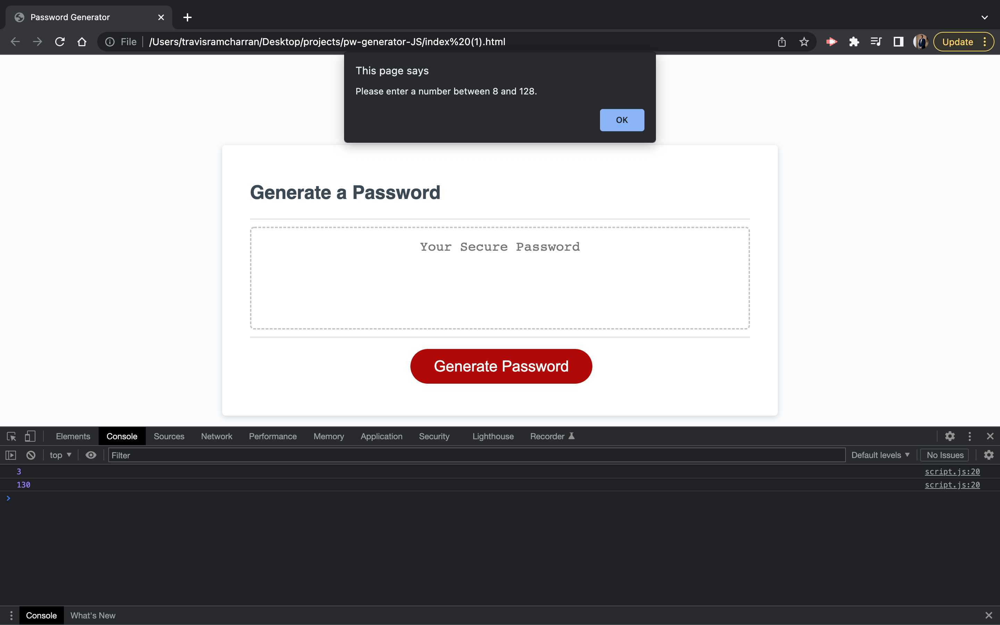
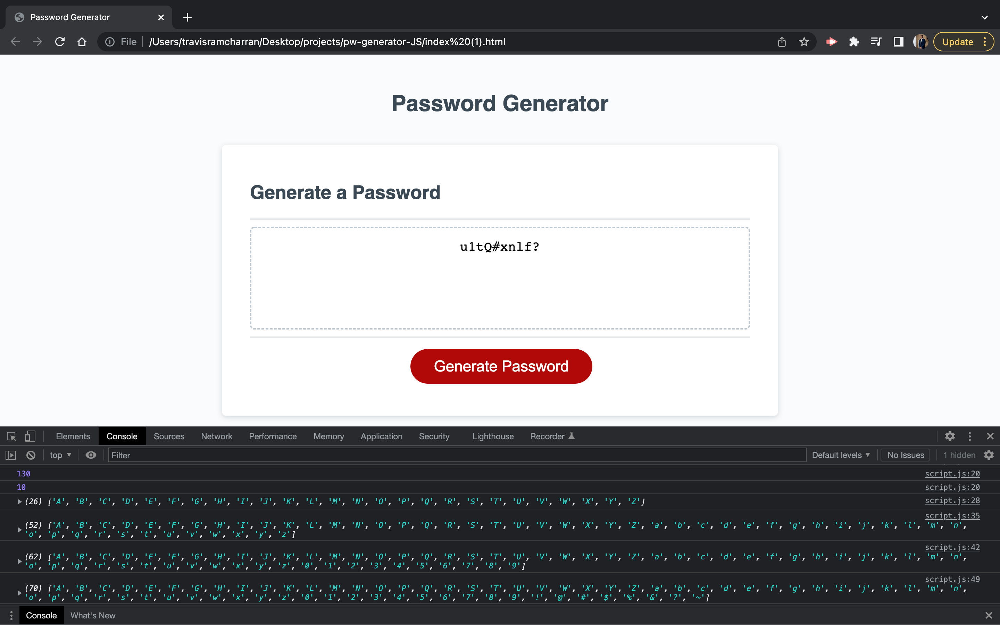

# pw-generator-JS
Password Generator using only Javascript!

## Description
This program uses mainly Javascript to create a password according to the users input. The user has to choose a password length between 8 and 128 characters, if they want uppercase, lowercase, symbols, and numbers in their password. Therefore, the user will be presented with a series of 'confirm' functions which are then validated using 'if' statements. Then that information is stored into the validPasswordCharacters array. A for loop was then created to generate the 'randomness' of the password. 

## Installation

First I created a repository on Github called pw-generator-JS. 
Then used VSCode to copy and edit the script.js file. I did not edit the provided index.html and style.css files.

## Usage
I used my very basic knowledge of JS to create the code, along with help from my tutor and a few learning assistants.

## Screenshots

## Link to Password Generator

https://travisramcharran.github.io/pw-generator-JS/

## Credits
Thanks to my instructional team and support team for the advice and getting me in the right direction by providing me with a guideline on how the code should flow. I could not figure out the validation portion of the code on my own and I needed help creating the for loop. If it wasn't for their help, I would not have been able to create this code!